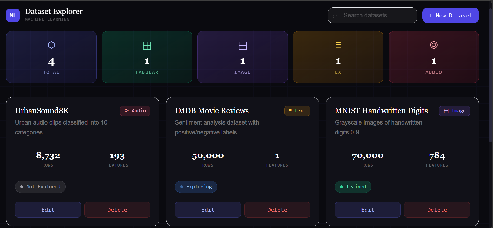

# ML Dataset Explorer 🧠

A full-stack Machine Learning Dataset Explorer built with **React + TypeScript + Tailwind CSS v3** (frontend) and **FastAPI + SQLite** (backend).

---
## 📸 Dashboard Preview

<p align="center">
  
</p>

## Features

- ✅ **Create** datasets with name, description, type, rows, features, and status
- ✅ **View** all datasets in a card-based layout
- ✅ **Edit** existing dataset details
- ✅ **Delete** datasets (with confirmation click)
- ✅ **Search** datasets by name (live search)
- ✅ **Status tracking**: Not Explored → Exploring → Ready for Training → Trained
- ✅ **Stats dashboard** showing totals by type
- ✅ **Seeded sample data** on first run

---

## Project Structure

```
ml-dataset-explorer/
├── backend/
│   ├── main.py             # FastAPI app with all endpoints
│   └── requirements.txt
└── frontend/
    ├── src/
    │   ├── api/            # Axios API calls
    │   ├── components/     # React components
    │   ├── types/          # TypeScript types
    │   ├── App.tsx         # Main app
    │   └── index.css       # Global styles + animations
    ├── package.json
    ├── vite.config.ts
    └── tailwind.config.js
```

---

## Setup & Running

### Backend

```bash
cd backend
pip install -r requirements.txt
uvicorn main:app --reload
# Runs on http://localhost:8000
```

### Frontend

```bash
cd frontend
npm install
npm run dev
# Runs on http://localhost:5173
```

Open your browser at **http://localhost:5173**

---

## API Endpoints

| Method | Endpoint | Description |
|--------|----------|-------------|
| GET | `/datasets` | Get all datasets (supports `?search=name`) |
| GET | `/datasets/{id}` | Get a single dataset |
| POST | `/datasets` | Create a new dataset |
| PUT | `/datasets/{id}` | Update a dataset |
| DELETE | `/datasets/{id}` | Delete a dataset |
| GET | `/datasets/stats` | Get type statistics |

### Sample Dataset Object

```json
{
  "id": 1,
  "name": "Iris Dataset",
  "description": "Flower classification dataset",
  "type": "Tabular",
  "rows": 150,
  "features": 4,
  "status": "Ready for Training"
}
```

---

## Dataset Types
- **Tabular** — structured row/column data
- **Image** — image classification datasets
- **Text** — NLP / sentiment datasets
- **Audio** — sound classification datasets

## Dataset Statuses
1. Not Explored
2. Exploring
3. Ready for Training
4. Trained
